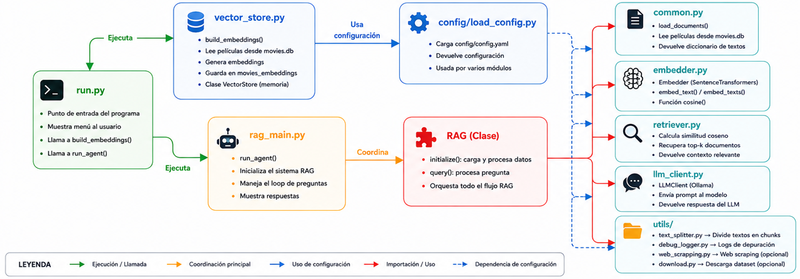
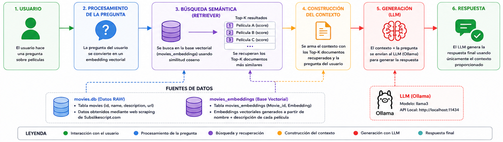

# RAG System – Recuperación Aumentada con Generación para Recomendación de Películas

Enlace de repositorio: https://github.com/nadiejcp/rag_system

Proyecto final del curso de Inteligencia Artificial enfocado en la construcción de un sistema RAG (*Retrieval-Augmented Generation*) utilizando embeddings semánticos, recuperación contextual y modelos LLM locales mediante Ollama.

El sistema implementa un pipeline completo que:

* obtiene información de películas mediante *web scraping*,
* genera embeddings semánticos,
* almacena vectores en SQLite,
* recupera documentos relevantes,
* y utiliza un modelo LLM para responder consultas en lenguaje natural.

---

# 1. Introducción

## Problema

Los modelos LLM poseen gran capacidad generativa, pero presentan limitaciones cuando necesitan responder sobre información específica o estructurada que no forma parte de su entrenamiento.

En este proyecto se busca resolver ese problema mediante un sistema RAG aplicado a un catálogo de películas.

El objetivo es permitir consultas como:

> “Películas sobre viajes espaciales y supervivencia”

o

> “Películas similares a Interstellar”

utilizando recuperación semántica basada en embeddings antes de generar la respuesta final.

---

## Aproximación general

La solución implementada sigue el siguiente flujo:

1. Obtención de datos mediante *web scraping*.
2. Almacenamiento de películas en SQLite.
3. Generación de embeddings semánticos.
4. Construcción de un vector store.
5. Vectorización de consultas del usuario.
6. Recuperación de películas relevantes mediante similitud de cosenos.
7. Construcción de contexto para el LLM.
8. Generación de respuesta utilizando Ollama + Llama3.

---

# 2. Diseño del sistema

## Estructura del proyecto

Conexión de los archivos principales del proyecto:



Arquitectura del RAG:



---

## Configuración del sistema

El sistema utiliza:

* Python
* SQLite
* Ollama
* Sentence Transformers

La configuración principal se encuentra en:

```text
config/config.yaml
```

---

## Base de datos

La información de películas se almacena en:

```text
data/movies.db
```

El proyecto utiliza SQLite debido a:

* simplicidad,
* portabilidad,
* facilidad de despliegue académico.

Actualmente existen dos tablas principales:

* `movies`
* `movies_embeddings`

---

## Web Scraping

El módulo:

```text
utils/web_scrapping.py
```

obtiene información de películas y genera el dataset inicial.

Cada película contiene:

* identificador,
* nombre,
* descripción.

---

## Servidor LLM

El proyecto utiliza Ollama para ejecutar modelos LLM localmente.

Modelo utilizado:

```text
llama3
```

Los scripts:

```text
install.bat
start.bat
```

permiten:

* instalar dependencias,
* descargar modelos,
* iniciar el sistema.

---

# 3. Embeddings

## Embedder – Modelo

El archivo:

```text
embedder.py
```

transforma texto natural en embeddings semánticos utilizando:

```text
sentence-transformers/all-MiniLM-L6-v2
```

Este modelo fue seleccionado por:

* bajo costo computacional,
* rapidez,
* buena representación semántica.

Los embeddings son generados a partir de:

```text
movie_name + description
```

y retornados como vectores numéricos.

---

## Funcionalidad – Vector Store

El módulo:

```text
vector_store.py
```

se encarga de:

1. leer películas desde SQLite,
2. generar embeddings,
3. serializar vectores,
4. almacenarlos en `movies_embeddings`.

Actualmente SQLite funciona como vector store.

Aunque esta solución no es ideal para producción, resulta adecuada para:

* datasets pequeños,
* pruebas académicas,
* prototipado rápido.

Para escalabilidad futura se recomienda:

* FAISS,
* ChromaDB,
* Pinecone.

---

# 4. RAG

## Embedder para la query del usuario

Cuando el usuario realiza una consulta:

1. la query se transforma en embedding,
2. utilizando el mismo modelo semántico.

Esto permite comparar la consulta con las películas almacenadas.

---

## Similitud de cosenos

La recuperación utiliza similitud de cosenos implementada manualmente.

El sistema:

* compara la query contra todos los embeddings,
* ordena resultados,
* selecciona los Top-K documentos.

Configuración actual:

```text
Top-K = 3
```

---

## Selección de modelo LLM

El modelo utilizado es:

```text
llama3
```

ejecutado localmente mediante Ollama.

Esto permite:

* ejecución offline,
* privacidad,
* independencia de APIs externas.

---

## Diseño de prompt

El sistema construye dinámicamente un prompt que incluye:

* contexto recuperado,
* películas relevantes,
* consulta original del usuario.

Esto permite generar respuestas contextualizadas y reduce alucinaciones del modelo.

---

## API Request

El módulo:

```text
llm_client.py
```

realiza la comunicación con Ollama mediante requests HTTP.

Finalmente:

1. el LLM recibe contexto,
2. genera una respuesta,
3. y el sistema la devuelve al usuario.

---

# Ejecución del proyecto

## Paso 1

Descargar Ollama:

```text
https://ollama.com/download/windows
```

Para este proyecto se utilizó un modelo ligero debido a limitaciones de memoria y hardware. Aunque el modelo puede cambiar según las capacidades del equipo, `llama3` resultó suficiente para este proyecto académico.

Posterior a la instalación de Ollama, configurarlo como variable de entorno para poder ejecutarlo directamente desde la terminal.

Una vez configurado, ejecutar:

```bash
ollama pull llama3
```

---

## Paso 2

Ejecutar:

```text
install.bat
```

Este script:

* instala dependencias,
* crea el entorno virtual,
* y prepara el proyecto.

---

## Paso 3

Ejecutar:

```text
start.bat
```

Este script inicia el sistema y configura los componentes necesarios para la ejecución del RAG.

---

## Paso 4

La base de datos y los pesos del modelo de embeddings ya se encuentran descargados al clonar este repositorio.

Si se desea reiniciar completamente el proyecto desde cero, eliminar las carpetas:

```text
data/
model_cache/
```

---

# Tecnologías utilizadas

* Python
* SQLite
* Ollama
* Llama3
* Sentence Transformers
* NumPy
* Requests

---

# Consideraciones

Este proyecto fue desarrollado con fines académicos como parte de un curso de Inteligencia Artificial.

El enfoque principal fue:

* comprender arquitectura RAG,
* embeddings semánticos,
* recuperación contextual,
* e integración con modelos LLM locales.

---

# Mejoras futuras

* Migración a vector databases especializadas.
* Indexación eficiente para datasets grandes.
* Re-ranking semántico.
* Evaluación automática de respuestas.
* Interfaz web interactiva.
* Streaming de respuestas del LLM.
